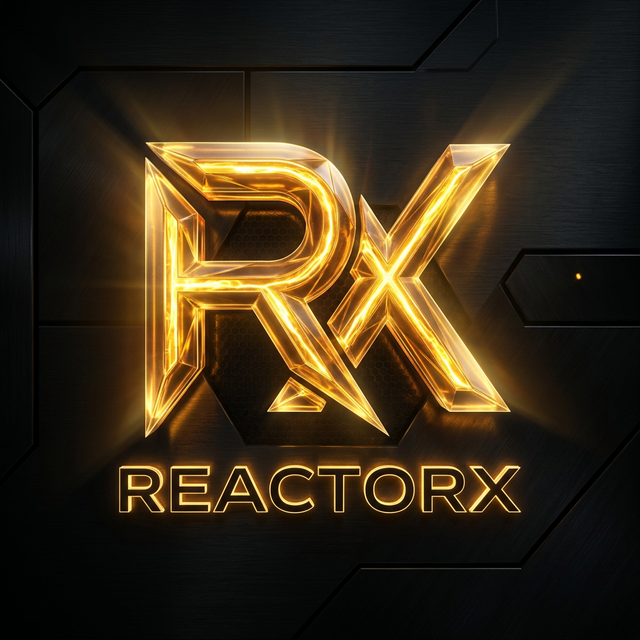

<div align="center">
  
</div>

<h1 align="center">ReactorX</h1>
<p align="center">
  <strong>The Ultimate Autonomous Liquidation Engine for Somnia Network</strong>
</p>

<div align="center">
  Built for the <b>Somnia Reactivity Mini Hackathon 2025</b> 🏆 <br/>
  Zero keepers. Zero off-chain bots. 100% on-chain physics.
</div>

---

## ⚡ What is ReactorX?

In traditional DeFi lending protocols, liquidations rely on incentivized off-chain bots or "keepers" who constantly monitor the chain and race to call liquidation functions when a position becomes undercollateralized. This introduces latency, MEV extraction, and centralization risks.

**ReactorX** completely eliminates the need for keepers by leveraging **Somnia Network's Native Event Reactivity**.

Instead of waiting for a bot, ReactorX subscribes directly to `PositionUpdated` events emitted by the lending protocol. When an oracle price drops and a position becomes undercollateralized, Somnia's validator network intrinsically triggers the `ReactorEngine` via the Reactivity Precompile (`0x0100`), which instantly and autonomously executes the liquidation. 

Fast. Unstoppable. Fully On-Chain.

## 🏗️ Architecture

The infrastructure consists of three main smart contracts:

1. **`LendingMock.sol`**: A core lending protocol mock where users deposit collateral (e.g., ETH) and borrow assets. It accurately tracks health factors based on a simulated oracle price. Emits the crucial `PositionUpdated` event.
2. **`ReactorEngine.sol`**: The "brain" of the reactivity layer. This contract interfaces directly with the Somnia Reactivity Precompile to subscribe to lending events. Upon catching an event, it validates the health factor and triggers the liquidation safely.
3. **`LiquidationManager.sol`**: Executes the heavy lifting of liquidating a bad debt position, seizing the collateral, and interacting with the primary lending protocol. Fully secured with OpenZeppelin Reentrancy Guards.

## 🎨 Premium Dashboard

The frontend serves as the institutional "Command Center" terminal. 

- **Glassmorphism & Real-Time Physics**: Built using cutting-edge Next.js architecture, featuring dynamic 3D depth, frosted glass lighting, and a magma-gold aesthetic.
- **Wagmi/Viem Integration**: Seamless wallet connection to the Somnia Testnet.
- **Admin Control Panel**: Effortlessly drop the simulated oracle price to force bad debt and instantly watch the on-chain reactivity liquidations happen live before your eyes.

## 🚀 Getting Started

### Prerequisites
- [Node.js](https://nodejs.org/) (v18+)
- [Git](https://git-scm.com/)
- RPC and Faucet: [Somnia Testnet Faucet](https://testnet.somnia.network)

### 1. Smart Contracts
Navigate to the root or `contracts` directory (where your hardhat config exists):

```bash
# Install dependencies
npm install

# Compile contracts
npx hardhat compile

# Deploy to Somnia Testnet
npx hardhat run scripts/deploy.ts --network somniaTestnet
```

### 2. Frontend
Navigate to the `frontend` directory:

```bash
cd frontend

# Install dependencies
npm install

# Run development server
npm run dev
```

Open [http://localhost:3000](http://localhost:3000) in your browser to see the dashboard.

## 🔐 Security Features
- **Reentrancy Protection**: All state-modifying functions and external calls enforce strict standard OZ `nonReentrant` modifiers.
- **Input Validation**: Hardened mathematical limits and input sanitization on both the frontend UI hooks and smart contract parameters.
- **Access Control**: Validated reactivity loops to ensure malicious addresses cannot force incorrect liquidations.

## 📜 License
MIT License.
